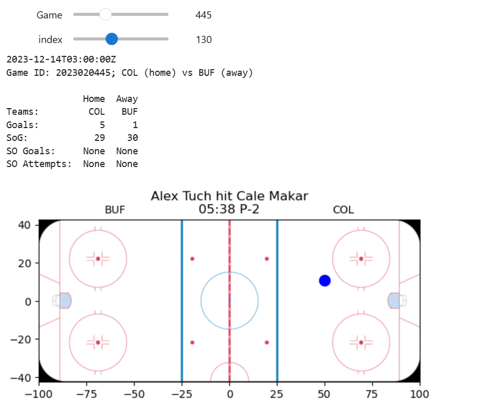

Ce post traite de l'outil interactif que nous avons créé qui permet de visualiser les événements directement sur la glace. Pour le run localement, tout le code nécessaire se trouve dans le notebook interactive_rink.ipynb. Ici nous partagerons que des extraits de code qui explicite la logique utilisée pour les sliders.
Voici l'outil en question :


Ce widget permet de défiler à travers les matchs et les évenements de chaque match. En indiquant un cours résumé de la partie (les équipes, les buts, les tirs cadrés, etc.). Pour chaque évenement, il indique en bleu où l'evenement se situe sur glace et écrit un court résume de ce qu'il s'est passé.

```python
# Extrait (code complet: notebooks/interactive_rink.ipynb)

def draw_play(index=0):
    ...

def on_game_change(change):
    ...

global all_plays, data, home, away, team_by_id, player_name

year = 2023
game_type = 2
data = get_game(year, game_type, 1)
all_plays = data["plays"]
home, away, team_by_id, player_name = play_context(data)

game_slider = widgets.IntSlider(
    value=1, min=1, max=1312, step=1, description="Game",
    continuous_update=False
)
play_ui = widgets.interactive(draw_play, index=(0, len(all_plays)-1, 1)) 
idx_slider = play_ui.children[0]  
game_slider.observe(on_game_change, names="value")

display(widgets.VBox([game_slider, play_ui]))
```