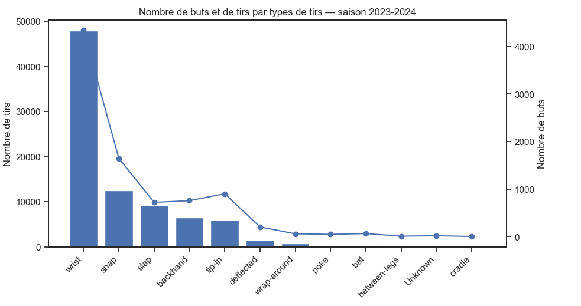
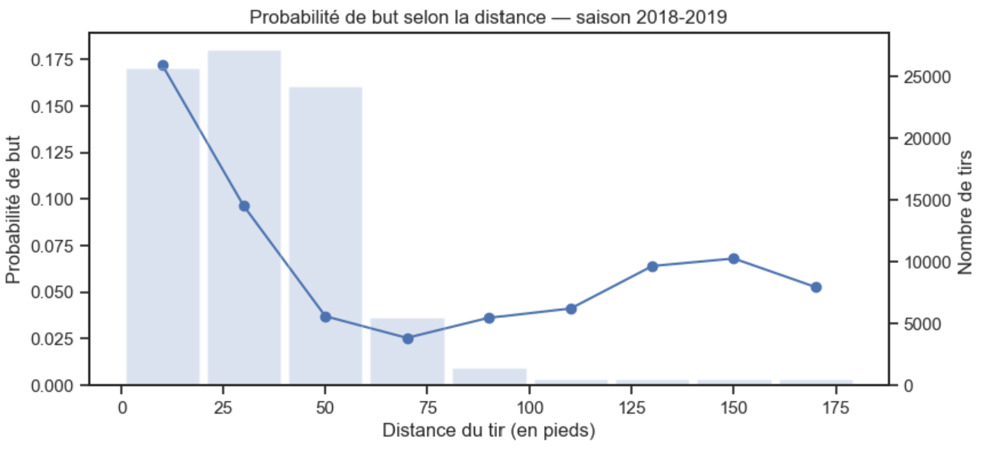
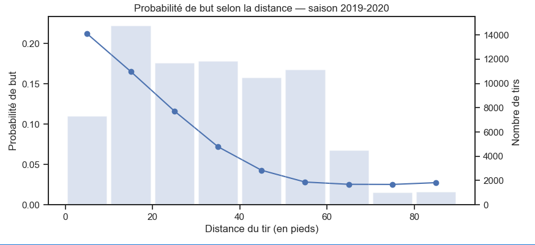
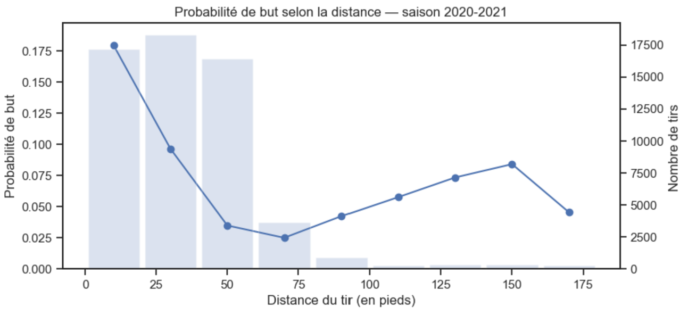
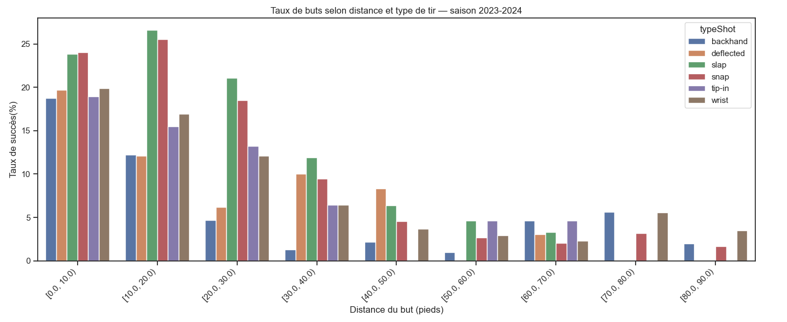

# Types de tirs : tirs vs buts

Le graphique montre que les wrists shots sont de loin les plus fréquent. Logiquement c'est donc aussi celui qui compte le plus de buts. Cependant les types de tirs que nous considérerons comme les plus dangereux sont ceux qui ont les meilleures conversions. Si on observe que la courbe de buts est pas mal au dessus de la barre on considère que c'est un tirs dangeureux. Par exemple pour cette saison on considère les snaps ou les tip-ins comme les tirs les plus dangereux.
### Pourquoi ce graphique?
Superposer le volume de tirs et le nombre de buts permet de distinguer ce qui est courant de ce qui est efficace sans confondre "beaucoup de buts" avec "beaucoup de tentatives".
# Distance vs probabilité de but

Pour les trois saisons la tendance reste la même, plus un tir est loin moins il a de chances d'être un but. Jusqu'à ce que le tir est très loin la probabilité remonte étrangement pour tous les graphes. Parce que pour ces distances là les tirs se font très très rares et ils arrivent presque uniquement lorsque le gardien n'est pas dans le but.
### Changements entre saisons?
Pas vraiment, on remarque juste qu'il y a plus de variabilité lorsque l'effectif des bins est plus petit mais la forme de la courbe et des bins reste plutôt stable.
### Pourquoi ce graphique?
La courbe montre directement la probabilité et l'histogramme du nombre de tirs indique où l'estimation est la plus fiable.
### Calcul de la distance
Malheureusement, il n'y a pas de convention typique tel que l'équipe qui joue chez elle commence à droite. Donc, afin de calculer la distance des tirs, il fallait s'assurer que le calcul se faisait avec le bon filet (celui que l'équipe attaque réellement). Nous avons donc d'abord implémenté une fonction qui trouve le côté d'attaque de l'équipe au moment du tir, puis nous calculons la distance euclidienne entre les coordonnées du tir (xCoord, yCoord) et les coordonnées du filet visé (x_but, 0) où x_but ∈ {-89,+89}.

Pour trouver le côté d'attaque on s'appui sur l'idée suivante : une équipe tire majoritairement vers le filet adverse au cours d'un période donnée. Donc on regroupe les tirs d'une même équipe par période et on observe la distribution des xCoord. Si la majorité sont positives on en déduit que l'équipe attaque le filet en x = +89 et à l'inverse si la majorité est négative on conclut qu'elle attaque le filet en x = -89.

# Probabilité de but selon la distance + le type de tir

Ce graphique démontre que la distance est beaucoup plus influente pour la probabilité de but. Les taux de buts sont clairement plus élevés près du filet et chutent rapidement. Le graphe permet aussi de voir que certains type de tirs marchent mieux de proche que de loin comme les tip ins et d'autres inversement, certains semble plus efficace de loin comme les deflections et finalement d'autres marchent assez bien de proche et loin comme les snaps et slaps shots. On remarque aussi le sommet du graphique, les slaps shots de 10 à 20 pieds du buts semblent être le type de tir le plus dangereux parmis tous.
### Remarque :
Pour tous les graphiques de ce blog si l'on souhaite grapher une autre saison que celle affichée on peut le faire avec le notebook simple_viz.ipynb.

