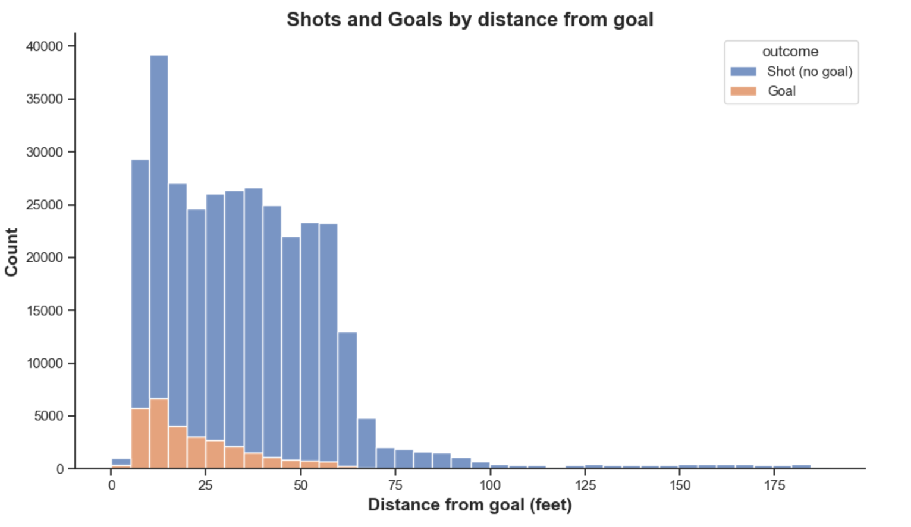
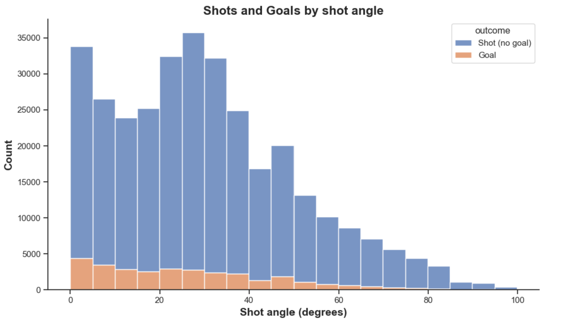
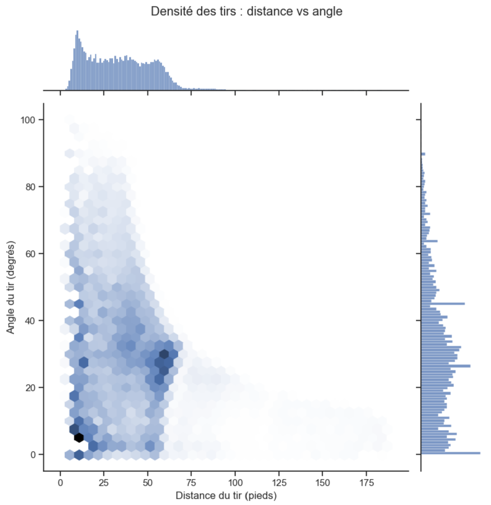
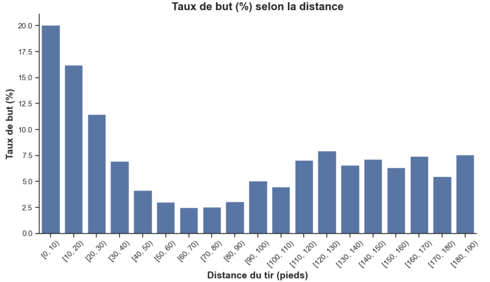
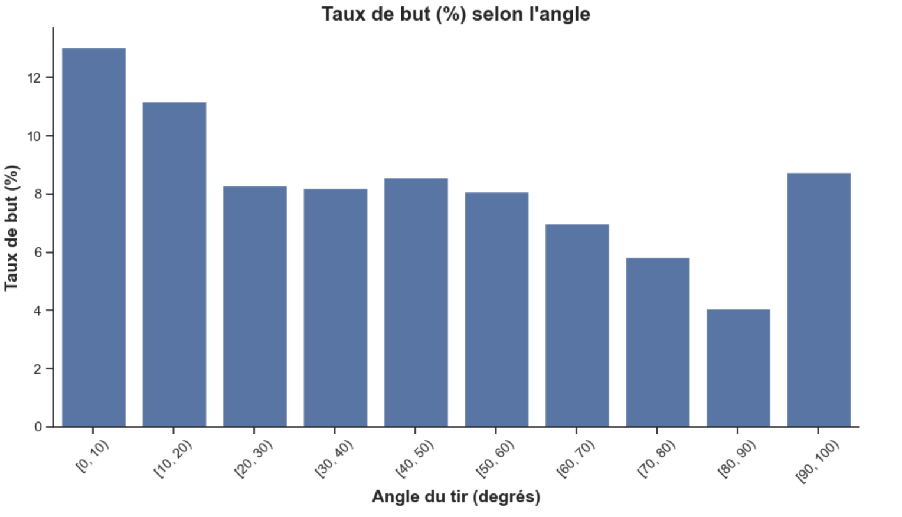
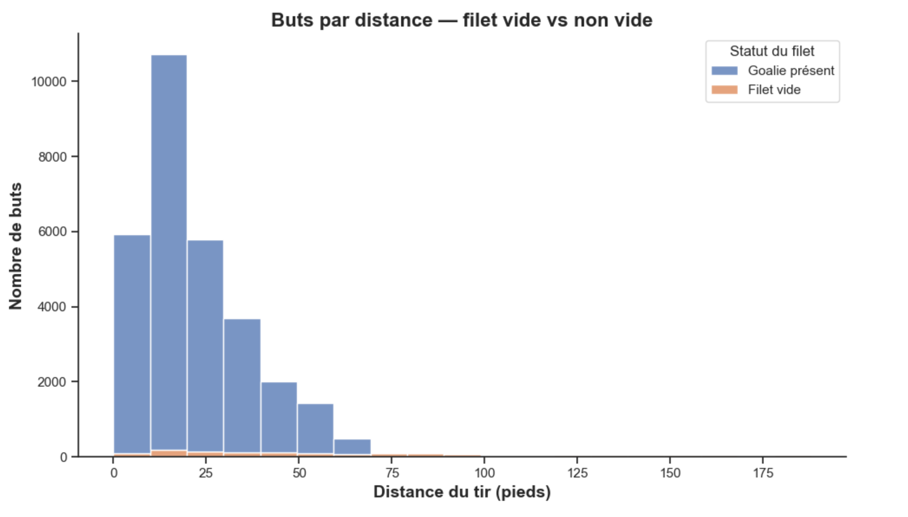
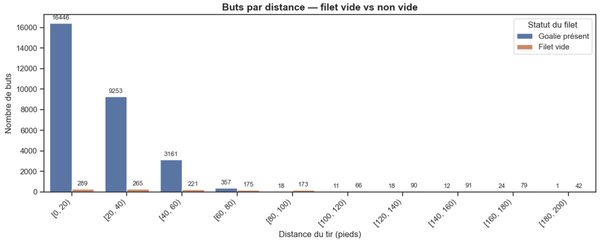

Il est observable sur ce graphique que la grande majorité des tirs sont de distance moyenne. Il y a très peu de tirs tout proche (dans les premiers 5 pieds) parce qu'il est difficile d'atteindre cette zone, et ensuite il y a très peu de tirs passé 70 pieds et voir presque aucun à partir de 100 pieds. Il est aussi remarquable que la majorité des buts sont proches du filet et plus la distance diminue plus ils diminuent aussi.

La grande majorité des tirs sont en face du filet ça n'est pas très étonnant qu'il y ai moins de tirs pris à des angles extrêmes. Il y a même quelques tirs derrière la cage (passé 90°).

Ce graphique permet de voir où se concentre réellement le volume de tirs. Il y a beaucoup de tirs à distance moyenne et angles modérés et on voit moins d'observations dans les extrêmes (angles improbables ou très distant).

Le taux de but est le plus important lorsqu'on se trouve très proche du filet et il diminue assez rapidement avec la distance. Ensuite étrangement il rehausse légerement lorsqu'on passe la moitié de la patinoire. On explique cela par le fait que les équipes ne prennent presque aucun tir aussi loin et le font presque uniquement lorsque le gardien n'est pas dans les cages.

Ici les taux diffèrent moins, on observe que les chances de buts sont plus élevées lorsqu'on est en face du filet et elles diminuent légerement lorsque l'angle est plus "fermé". Puis le taux de but est un peu plus haut lorsqu'on tire de derrière la cage.

Il est remarquable que pour des distances plus proches la très grande majorité des buts sont avec un gardien présent tandis que pour les tirs très loin on voit que des toutes petites barres oranges indiquant que ce sont des buts avec un filet vide. Il faut considérer que les buts en filet vide surviennent dans des situations particulières (fin de match, engagement, dégagements vers le filet adverse). Cela crée une distribution qui ne reflète pas la dynamique habituelle d’un tir contre un gardien. 

Pour les distances très élevées, nous trouvions qu'il était difficile de voir l'ampleur des buts pour un filet vide et non-vide, les barres devenaient tellement petites qu'on ne les voit pas sur le graphique. Nous avons donc fait ce graphique avec la taille de barres indiquées. On observe plusieurs valeurs aberrantes, tous les buts avec un gardien présent passé 100 pieds sont assez curieux. 