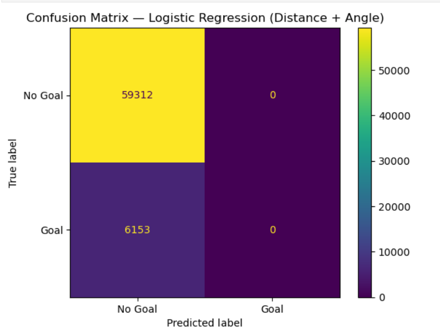
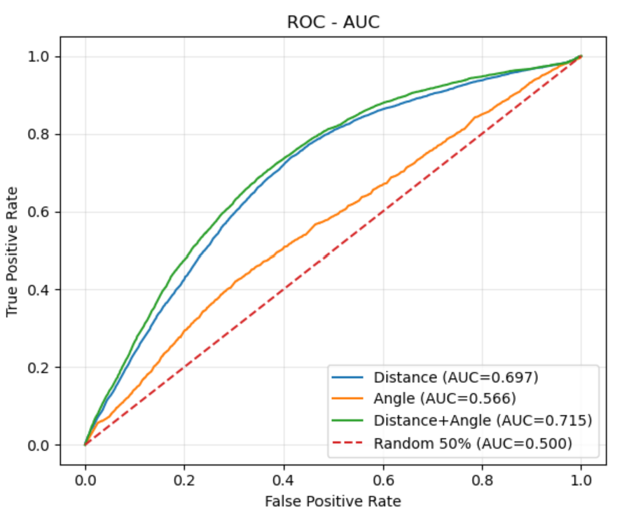
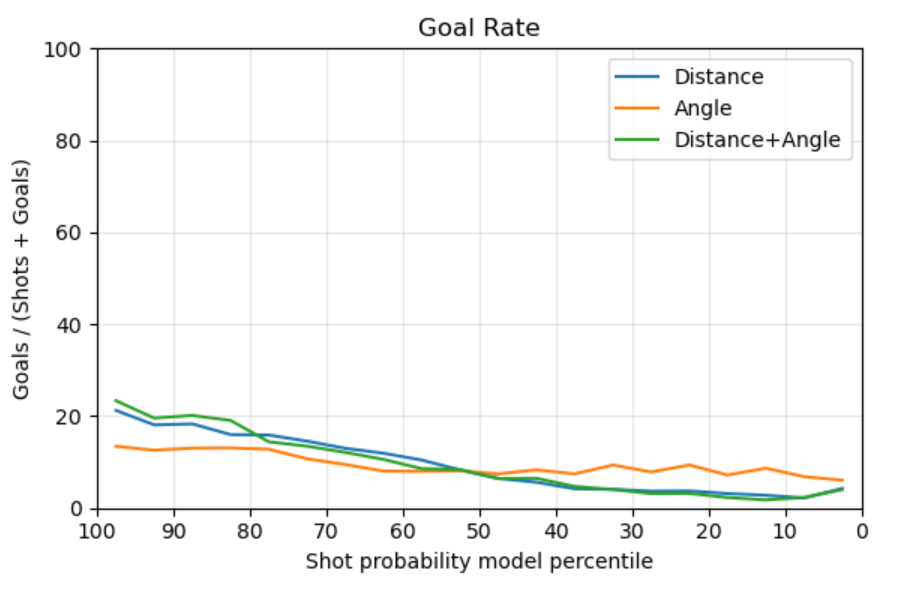
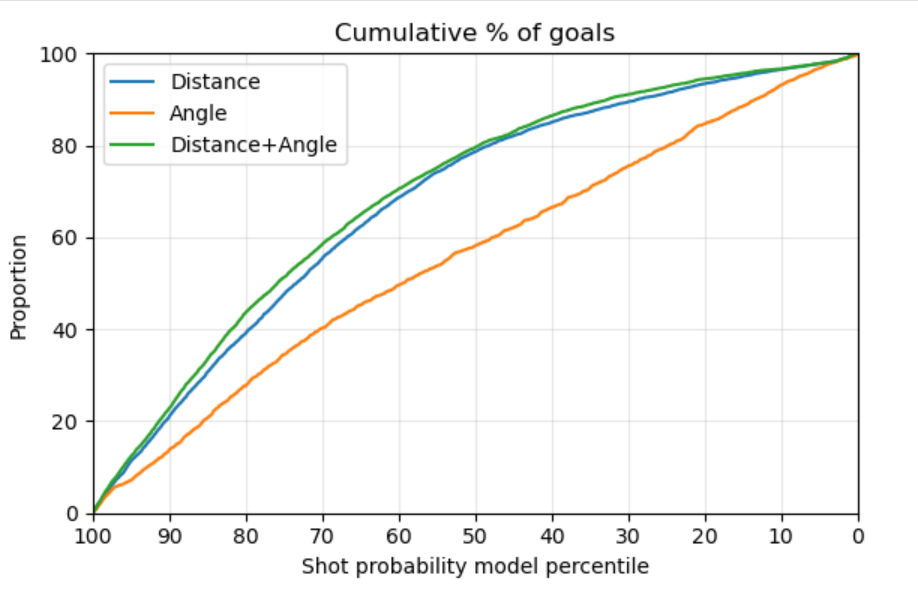
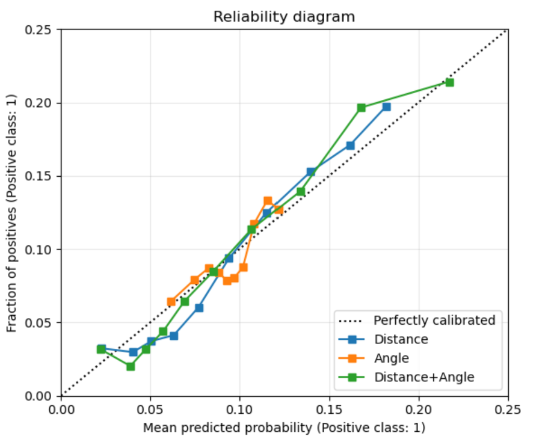

# Précision des modèles de base

Même s'il fallait uniquement expliciter la précision pour la régresion logistique basé sur la distance nous avons fait les matrices de confusions pour tous nos modèles de base (distance, angle et distance + angle) afin de comparer leur comportement. Dans ce cas, c'était la même pour les trois. Ce qui saute aux yeux c'est que le modèle prédit tout simplement toujours que les tirs ne seront pas un but. Puisque la majorité des tirs ne sont pas des buts la précision des modèles est tout de même assez bonne. Elle est à peu près de 90.6 % mais ce résultat qui peut paraître bon est tromper, il représente surtout l'imbalance des classes de buts et non-buts plutôt que la capacité réelle de prédire les buts. Le problème est simple, le seuil de décision par défaut est 0.5 et les buts n'arrivent pas assez souvent pour qu'une certaine combinaison d'angle et de distance font que les tirs d'un certain endroit ont plus de 50% de chances de rentrer. Pour cette raison le modèle considère aucun tirs suffisament dangereux pour prédire un but.

Il faut donc considérer autre chose que la prédiction binaire, la probabilité prédite par les modèles est plus intéressante.

# Comparaisons des modèles 

### Receiver Operating Characteristic (ROC) - Area Under Curve (AUC)

Tout d'abord, les trois modèles performent mieux qu'un classificateur aléatoire (AUC = 0.5), ce qui indique qu'ils captent quelque chose d'utile pour ordonner les tirs du plus dangereux au moins dangereux. 
Par contre, les performances diffèrent nettement : le modèle basé uniquement sur l'angle de tir performe clairement moins bien (AUC = 0.566 donc relativement proche du hasard) que les deux autres. Le modèle basé sur la distance est déjà nettement meilleur (AUC = 0.697) et l'ajout de l'angle l'améliore encore (AUC = 0.715). Cela suggère que la distance contient l'essentiel de l'information tandis que l'angle est plus une information complémentaire.

### Taux de buts par centiles

Toutes les trois courbes sont clairement croissante lorsqu'on se déplace vers les centiles élevés (droite à gauche). Ceci veut dire que plus les modèles attribuent une probabilité élevée à un tir, plus le taux de buts observé augmente ce qui confirme qu'ils classent globalement bien les tirs selon leur dangerosité.
On voit aussi que le modèle basé sur l'angle progresse moins rapidemenet, dans les centiles les plus élevés il sépare moins bien les tirs dangereux des tirs ordinaires contrairement aux deux autres modèles.

### Proportion cumulée de buts par centiles

Il faut interpréter cette courbe ainsi : "si l'on ne garde que les tirs les mieux classés par le modèle (top p %) quelle fraction de tous les buts retrouve-t-on?". Un bon modèle concentre les buts dans les centiles élevés et capture donc une grande fraction des buts très tôt dans la courbe. Dans notre cas, les modèles qui utilisent la distance capturent une bonne portion des buts plus tôt que le modèle basé uniquement sur l'angle. La courbe du modèle basé sur l'angle est constamment en dessous. 

### Diagramme de fiabilité

Ce diagramme compare la probabilité moyenne prédite dans un groupe à la fréquence réelle de buts dans ce même groupe. En gros si le modèle prédit 0.10 on aimerait observer autour de 10% des buts dans ce groupe et donc les courbes proche de la diagonale sont indactrices de probabilités bien calibrées. Lorsque la courbe est sous la diagonale on surestime et au dessus on sous estime.
Dans notre cas nous avons zoomé le graphique parce que les probabilités prédites restent dans un plage relativement faible (pas plus haut que 0.22). Sur cette plage les trois modèles restent assez proches de la diagonale ce qui suggère une calibration raisonnable. On observe quand même des zones où les modèles alternent entre surestimation et sous-estimation.

## Conclusion

En résume la distance est la caractéristique la plus informative et l'angle seul est insuffisant. L'angle apporte quand même un gain lorsqu'il est combiné à la distance. 