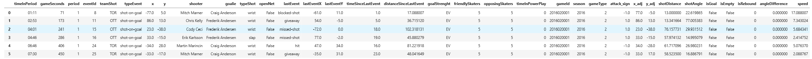

Pour cette section, nous devions ajouter de nouvelles caractéristiques au jeu de données. Or, nous avions déjà une fonction qui créait le DataFrame (comme on l’a montré en aperçu dans plusieurs notebooks). Pour intégrer ces nouvelles caractéristiques, nous les avons donc directement implémentées dans ces fonctions.

Concrètement, cela signifie que si l’on relance maintenant les premiers notebooks, on obtient directement le DataFrame après cette étape du projet. Si vous exécutez le projet en local et que vous souhaitez voir à quoi ressemblait le DataFrame avant ces ajouts, il est affiché dans d’anciens posts du blog.

## Caractéristiques créées 
- gameSeconds : nombre total de secondes écoulées depuis le début du match (toutes périodes confondues).

- attack_sign : indicateur (+1 / −1) qui encode le sens d’attaque afin de standardiser les coordonnées (attaquer toujours vers le même côté).

- x_adj : coordonnée x ajustée/standardisée selon attack_sign (même référentiel pour tous les tirs).

- y_adj : coordonnée y ajustée/standardisée selon attack_sign.

- shotDistance : distance entre la position du tir (x_adj, y_adj) et le centre du filet adverse.

- shotAngle : angle de tir (en degrés) par rapport à l’axe du filet adverse.

- isGoal : variable binaire indiquant si l’événement est un but.

- isEmpty : variable binaire indiquant si le but/tir est associé à un filet désert (dérivé de openNet / infos gardien).

- lastEvent : type de l’événement précédent (ex. blocked-shot, giveaway, etc.), utile pour le contexte de la séquence.

- lastEventX : coordonnée x de l’événement précédent.

- lastEventY : coordonnée y de l’événement précédent.

- timeSinceLastEvent : temps (en secondes) écoulé depuis l’événement précédent.

- distanceSinceLastEvent : distance entre l’événement précédent (lastEventX, lastEventY) et l’événement courant (x, y ou coordonnées ajustées selon votre implémentation).

- isRebound : variable binaire indiquant si le tir est un “rebound” (retour), typiquement détecté via un tir précédent proche dans le temps et/ou l’espace.

- angleDifference : variation d’angle (différence) entre le tir précédent et le tir courant (seulement si lastEvent est aussi un tir).

- speed : “vitesse” estimée de la séquence juste avant le tir, généralement distanceSinceLastEvent / timeSinceLastEvent.

- goalStrenght : état de supériorité numérique au moment de l’événement (ex. EV = Even Strenght, PP = Power Play, SH = Short Handed).

- friendlySkaters : nombre de patineurs de l’équipe qui effectue le tir au moment de l’événement.

- opposingSkaters : nombre de patineurs de l’équipe adverse au moment de l’événement.

- timeInPowerPlay : nombre de secondes écoulées depuis le début de l’avantage numérique de l’équipe du tir (0 si pas en power play).

## TODO creer artefact WandB