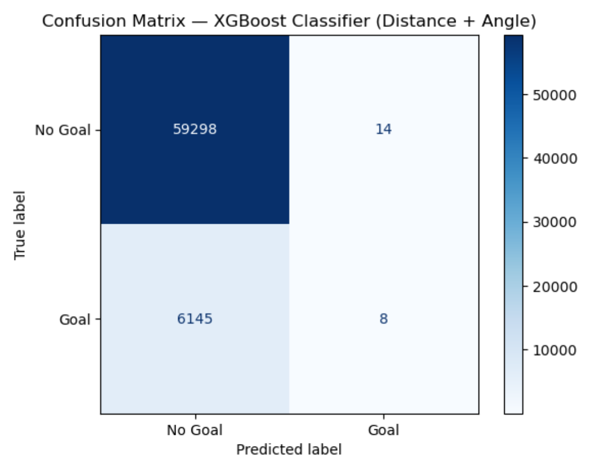
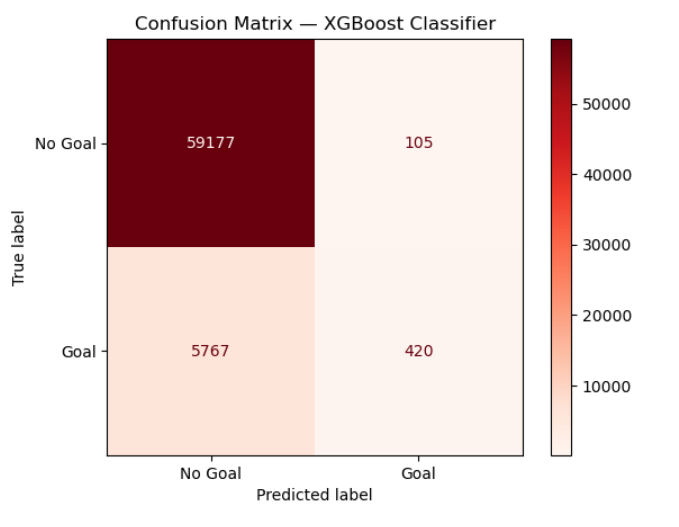
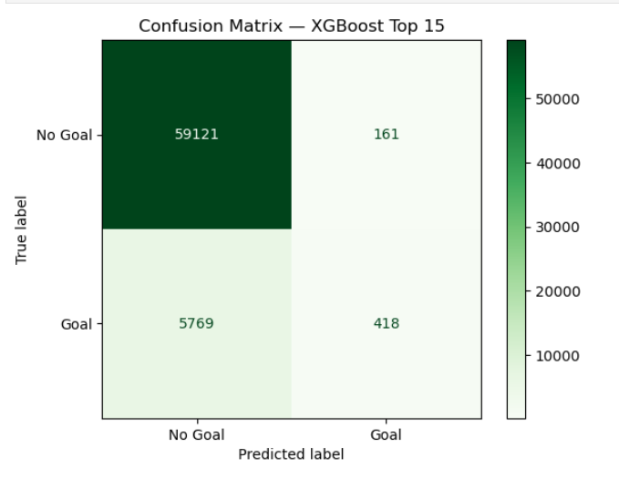
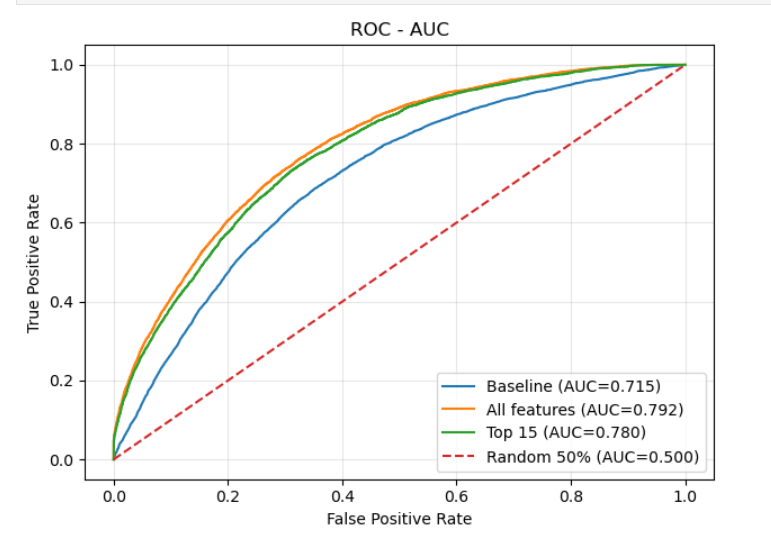
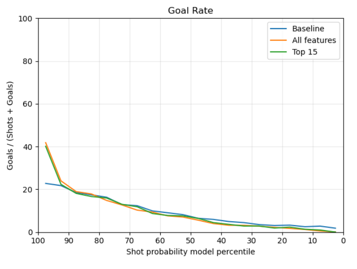
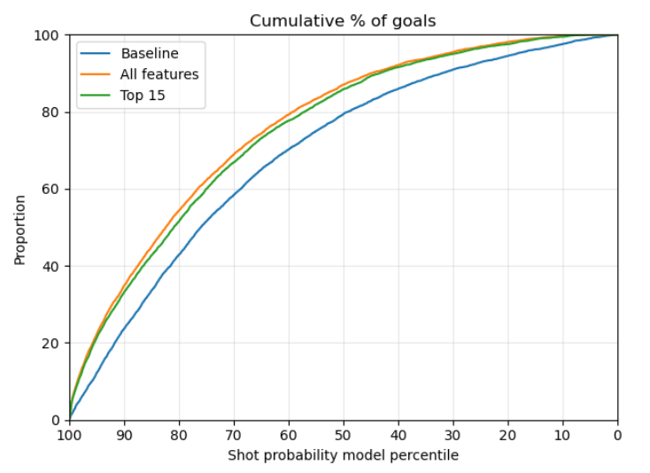

# Baseline
Afin d’établir un point de comparaison (baseline) pour nos classifieurs XGBoost, nous avons d’abord entraîné un modèle simple en n’utilisant que la distance et l’angle comme caractéristiques. Nous n’avons effectué aucun ajustement d’hyperparamètres et simplement conservé les valeurs par défaut.

Voici les résultats obtenus :
- accuracy	0.90592
- auc	0.71539
- log_loss	0.2869

## All Features
Nous avons ensuite entraîné un second modèle en lui fournissant l’ensemble des caractéristiques de notre DataFrame (celles décrites dans la section Feature Engineering II), tout en gardant exactement les mêmes hyperparamètres.

On obtient alors les résultats suivants : 
- accuracy	0.91094
- auc	0.77213
- log_loss	0.26289

# Calibration des hyperparamètres (hyperparameter tuning)
Afin d’améliorer les performances, nous avons procédé à une calibration des hyperparamètres via une validation croisée aléatoire (randomized search). Cette approche nous permet d’explorer efficacement l’espace des hyperparamètres sans entraîner le modèle sur toutes les combinaisons possibles (ce qui serait trop coûteux en temps de calcul).

Nous avons choisi la log loss comme métrique principale à minimiser, car elle évalue directement la qualité des probabilités prédites (et pas seulement la classe finale). Dans notre contexte, l’objectif est d’obtenir une probabilité de but (xG) qui soit la plus fidèle possible.

À l’issue de cette recherche, nous avons obtenu un ensemble d’hyperparamètres optimaux, avec plusieurs configurations très proches donnant des performances similaires. Voici les résultats :
- Best CV score: -0.26133932166019797
- Best params: {'subsample': 1.0, 'reg_lambda': 1.5, 'reg_alpha': 0, 'n_estimators': 1000, 'min_child_weight': 5, 'max_depth': 5, 'learning_rate': 0.03, 'gamma': 0.5, 'colsample_bytree': 0.6}

Et les résultats du modèle après calibration :
- accuracy	0.91146
- auc	0.77899
- log_loss	0.25996

# Sélection des caractéristiques (feature selection)

Maintenant dans le but de garder des performances relativement similaire mais en utilisant une puissance de calcul plus raisonnable on décide de selectionner uniquement les caractéristiques qui influencent le plus le modèle. Nous avons donc utilisé la librairie SHAP pour faire des grpahiques qui nous montrent justement l'influence des caractéristiques. 

Et les résultats du modèele qui considère que le top 15 caractéristiques :
-
-
-

# Comparaisons des modèles 
Si vous avez oublié comment il faut lire ces courbes nous expliquons vite fait ce quelles cherchent à visualiser dans le post sur les modèles simples. 

### Receiver Operating Characteristic (ROC) - Area Under Curve (AUC)

### Taux de buts par centiles

### Proportion cumulée de buts par centiles

### Diagramme de fiabilité

## Conclusion